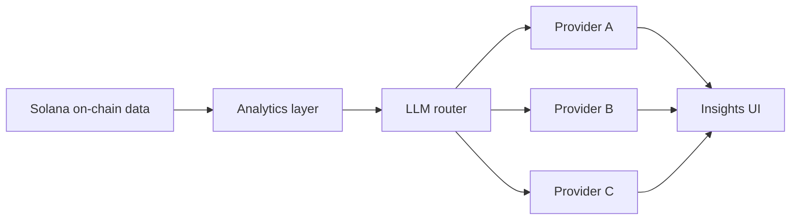

<div align="center">

<a href="https://github.com/Procoder1234556">
  <picture>
    <source media="(prefers-color-scheme: dark)" srcset="https://raw.githubusercontent.com/Procoder1234556/Procoder1234556/main/dark_mode.svg">
    
  </picture>
</a>

<br />


# Nikunj

**Solana · AI agents · Linux**

I build agent-driven products on Solana and open-source LLM stacks, and ship them end to end.

[Email](mailto:p03490978@gmail.com) · [LinkedIn](https://www.linkedin.com/in/nikunjrustagi) · [X](https://x.com/zynloqdev)

</div>

---

## Focus

```text
solana    on-chain analytics, hackathon builds (Colosseum Frontier)
agents    LangGraph + Ollama pipelines, multi-provider LLM fallback
systems   Linux-first workflow, CI/CD with GitHub Actions
product   PRD, architecture, build, deploy: the full path, not just the code
```

## Selected work

### ChainPulse
AI-powered Solana on-chain analytics platform, submitted to the **Colosseum Frontier Hackathon**.

- Raw on-chain activity turned into readable, AI-assisted analytics
- Multi-provider AI fallback so insights keep flowing when one provider fails or rate-limits
- Architecture designed from scratch, UI shipped fast on a component-driven stack



*Simplified view of the data and AI path.*

### LoanMatters
AI education loan comparison platform. An agentic pipeline built on **LangGraph** and locally run open-source models via **Ollama**, with full documentation.

### Cyphud
A persistent AI memory layer delivered as a **Chrome MV3 extension**. Written up as a PRD and an architecture document, with an interactive frontend prototype.

### Sahii.in
Mobile spare parts e-commerce platform on **Node.js, Express and MongoDB**. Checkout flow, cash-on-delivery advance-charge logic, WhatsApp cart-abandonment reminders, and SEO/AEO work.

### FoundrSpeak
Media brand covering Indian startups, tech, and Web3. I built both the tech stack and the content operation behind it.

<!-- Add repo links under each project, e.g. [Repository](https://github.com/Procoder1234556/<repo-name>) -->

## How I build

- **Provider-agnostic AI.** Fallbacks and routing over single-vendor dependence.
- **Open-source first where it counts.** Local models when privacy and cost matter.
- **Write it down.** PRDs, architecture docs and READMEs ship with the code.
- **Ship the whole path.** From idea to deployed product, not demos that stop at the prototype.

## Stack

| Layer | Tools |
|---|---|
| Chain | Solana, on-chain analytics |
| Agents and AI | LangGraph, Ollama, multi-provider LLM fallback |
| Backend | Node.js, Express, MongoDB, Python |
| Frontend | TypeScript, JavaScript, Chrome extensions (MV3) |
| Systems | Linux, Git, GitHub Actions |

## Ecosystem

Active in **Superteam India**, **HackWithIndia** and the **Colosseum** builder community. I also publish through **FoundrSpeak**.

<div align="center">
  <sub>Open to Solana, AI agent and developer tooling collaborations.</sub>
  <br />
  <sub>Profile card based on <a href="https://github.com/Andrew6rant/Andrew6rant">Andrew Grant's self-updating README</a>.</sub>
</div>
